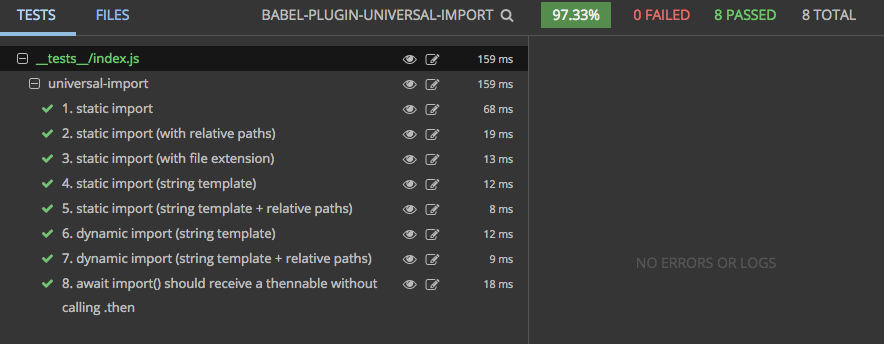

# babel-plugin-universal-import [](https://gitter.im/faceyspacey/Lobby)

<p align="center">
  <a href="https://www.npmjs.com/package/babel-plugin-universal-import">
    
  </a>

  <a href="https://travis-ci.org/faceyspacey/babel-plugin-universal-import">
    
  </a>

  <a href="https://lima.codeclimate.com/github/faceyspacey/babel-plugin-universal-import/coverage">
    
  </a>

  <a href="https://greenkeeper.io">
    
  </a>

  <a href="https://lima.codeclimate.com/github/faceyspacey/babel-plugin-universal-import">
    
  </a>

  <a href="https://www.npmjs.com/package/babel-plugin-universal-import">
    
  </a>

  <a href="https://www.npmjs.com/package/babel-plugin-universal-import">
    
  </a>
</p>


## Installation
```
yarn add babel-plugin-universal-import
```
*.babelrc:*
```js
{
  "presets": [whatever you usually have],
  "plugins": ["universal-import"]
}
```


## What it does
Taking from the [test snapshots](./__tests__/__snapshots__/index.js.snap), it does this:

```js
universal(import('./Foo.js'))

      ↓ ↓ ↓ ↓ ↓ ↓

import universalImport from 'babel-plugin-universal-import/universalImport.js'
import importCss from 'babel-plugin-universal-import/importCss.js'
import path from 'path'

universal(universalImport({
  chunkName: () => 'Foo',
  path: () => path.join(__dirname, './Foo.js'),
  resolve: () => require.resolveWeak('./Foo.js'),
  load: () => Promise.all([import( /* webpackChunkName: 'Foo' */ './Foo.js'), importCss('Foo')]),
  id: './Foo.js',
  file: 'parentFile.js',
}))
```

And if you're using dynamic imports:

```js
universal(({ page }) => import(`../async/${page}`))

      ↓ ↓ ↓ ↓ ↓ ↓

import universalImport from 'babel-plugin-universal-import/universalImport.js'
import importCss from 'babel-plugin-universal-import/importCss.js'
import path from 'path'

universal(({ page }) => universalImport({
  chunkName: () => `async/${page}`,
  path: () => path.join(__dirname, `../async/${page}`),
  resolve: () => require.resolveWeak(`../async/${page}`),
  load: () => Promise.all([import( /* webpackChunkName: 'async/[request]' */ `../async/${page}`), importCss(`async/${page}`)]),
  id: '../async/${page}',
  file: 'parentFile.js',
}));
```

It names all your chunks using *magic comments* 🔮 behind the scenes and is derived from the imported file. This works with both static and dynamic import paths, as you can see above.

Otherwise, what it's doing is providing all the different types of requires/paths/imports/etc needed by tools like [react-universal-component](https://github.com/faceyspacey/react-universal-component) to universally render your component.

The targeted **use-case** for all this is dynamic imports where you can pass a `page` prop to the resulting component, thereby allowing you to create one `<UniversalComponent page={page} />` for a large number your components. This is a major upgrade to the previous way of having to make a hash of a million async components in a wrapping component. You no longer have to think about *Universal Components* as anything different than your other components that use simple HoCs.

Perhaps the coolest part however is that it also attempts to import a separate CSS file along with js chunks for optimum chunk sizes, caching and performance. Look in what `Promise.all` does. 

And maybe even *cooler* to some: you don't have to do `universal(() => import())`. I.e. you don't have to wrap it in a function any longer when using `react-universal-component`, similar to `dynamic(import())` in Next.js...*unless of course you're making use of the awesome props feature, as showcased via the `page` prop.*


## Babel Server Or Webpack < 2.2.20

If your compiling the server with Babel, you may need to add this babel-plugin as well: [babel-plugin-dynamic-import-webpack](https://github.com/airbnb/babel-plugin-dynamic-import-webpack). And if you're using a version of Webpack before 2.2.0, you also must add it.

## Caveat

Lastly, to the discerning eye, you may be wondering if the return of `import()` is still *thenable*?? It is! However, if you don't call `.then` on it, somewhere (perhaps in the components like *react-universal-component* that you pass it to), then it won't perform the import. Since most of us are using modules, which we need to do something with in the `then` callback, that's not a problem. But if you happen to be importing a module that does its own setup, such as attaches something to the `window` object, well then you just need to call `.then()` to trigger it. That's a rare case these days, which is why we decided to go with the simplicity seen here. And yes, async await works too.

## Contributing

We use [commitizen](https://github.com/commitizen/cz-cli), so run `npm run cm` to make commits. A command-line form will appear, requiring you answer a few questions to automatically produce a nicely formatted commit. Releases, semantic version numbers, tags, changelogs and publishing to NPM will automatically be handled based on these commits thanks to [semantic-release](https://github.com/semantic-release/semantic-release). Be good.


## Tests

Reviewing a package's tests are a great way to get familiar with it. It's direct insight into the capabilities of the given package (if the tests are thorough). What's even better is a screenshot of the tests neatly organized and grouped (you know the whole "a picture says a thousand words" thing). 

Below is a screenshot of this module's tests running in [Wallaby](https://wallabyjs.com) *("An Integrated Continuous Testing Tool for JavaScript")* which everyone in the React community should be using. It's fantastic and has taken my entire workflow to the next level. It re-runs your tests on every change along with comprehensive logging, bi-directional linking to your IDE, in-line code coverage indicators, **and even snapshot comparisons + updates for Jest!** I requestsed that feature by the way :). It's basically a substitute for live-coding that inspires you to test along your journey.




